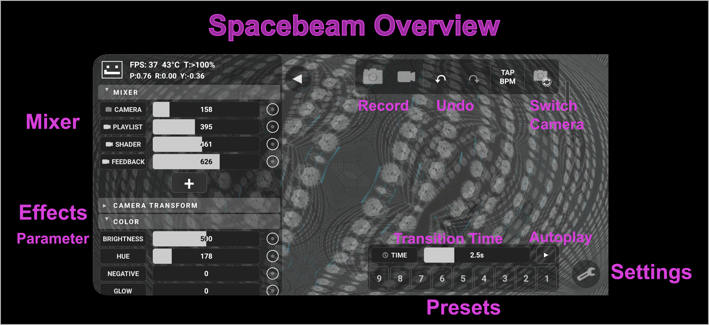
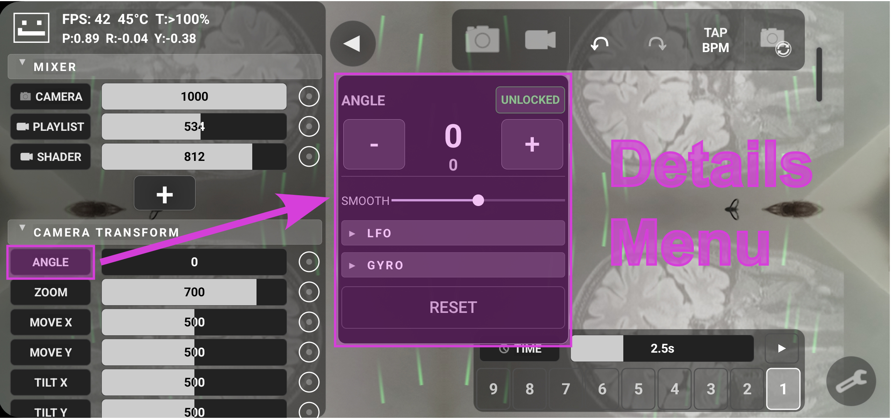
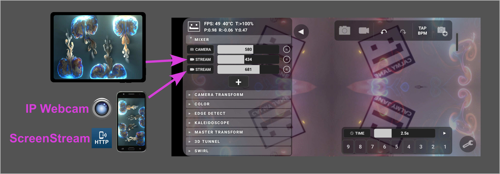

# SpaceBeam

**Real-time kaleidoscope visual synthesizer for Android**

SpaceBeam transforms your phone's camera into a live psychedelic visual instrument. Built for parties, concerts, and VJ performances, it turns any Android phone into a portable visual rig that streams to projectors, TVs, or LED walls via Miracast/SmartView.

No laptops. No cables. No expensive software. Just your phone.





---

## Quick Start

1. Launch SpaceBeam -- the front camera activates immediately
2. Preset 1 is active by default showing a simple 2x2 kaleidoscope.
3. Use two-finger gestures to zoom, rotate, pan.
4. Select one of the 9 preset buttons to transition to another preset
5. Adjust the slider above the presets to change the transition duration
6. Press the play button next to the slider to cycle through presets automatically
7. Press the camera/camcorder icon to take snapshot/video
8. Start changing parameters manually, adding new sources and saving your own presets
9. Have Fun! :)

---

## Recommended Setup

### Make fun videos

Just launch the app and record some fun videos with it to share with your friends.

### Basic: Phone + Projector

The simplest setup for a party or event:

1. Run SpaceBeam on a **Samsung Galaxy** phone (Samsung still supports Miracast via SmartView)
2. Connect to a projector or TV via:
   - **SmartView/Miracast** (wireless) -- look for "Smart View" in your quick settings
   - **Miracast-to-HDMI dongle** plugged into the projector
   - **USB-C to HDMI** cable (wired, zero latency)
3. Point the camera at the crowd, DJ booth, or interesting textures, load event logo as picture/video

### Advanced: Multi-Phone + Projector

For a more elaborate setup:

1. **Main phone** runs SpaceBeam and hosts a WiFi hotspot (no internet needed)
2. **Remote camera phones/tablets** connect to the hotspot and run [IP Webcam](https://play.google.com/store/apps/details?id=com.pas.webcam) -- add them as RTSP sources in SpaceBeam
3. **Screen-sharing phones** run [ScreenStream](https://github.com/nicholasgasior/screenstream) to share their screen -- run visual apps like Fraksl, Fluid, or even mobile games on those phones, and their screen becomes your input material
4. **Midi-Control** connect a bluetooth midi controller to easily change parameters without using the UI on the touchscreen



---

## Input Sources

SpaceBeam can mix multiple visual sources together. Tap the **+** button in the **mixer** section to add sources.
Each source has additional options when tapping it's name to open the **details menu**

### Camera

The built-in camera is the default source. Tap the camera switch button to cycle through all available cameras (front wide, back wide, back ultrawide, back telephoto, etc.).

### RTSP Stream

Stream video from another device over the local network. Enter the RTSP URL (shown in the streaming app on the remote device):

- **IP Webcam**: `rtsp://192.168.x.x:8080/h264_ulaw.sdp`
- **ScreenStream**: check the app for its RTSP URL

Great for remote cameras or streaming another phone's screen into SpaceBeam as visual material.

### Media Playlist

Load images and videos from your gallery. Multiple files become a playlist with configurable:

- **Duration** per item (for images)
- **Crossfade** time between items
- Drag to reorder, swipe to remove

Useful for party/DJ logos, pre-made visuals, or concert footage.

### Generative Shader

Procedurally generated visuals that don't need any camera input. Add one and it produces animated patterns on its own.
Find more shaders on shadertoy, but be aware that shaders can crush performance easily.

### Feedback

Uses the output of the effect chain itself as an input source -- creating recursive, evolving patterns. You can tap the feedback at different points in the effect chain to get different looks.
This is a very advanced technique and allows for complex effects. More in the **feedback loops** section.

### Source Options

Each source has these settings:

| Setting             | Description                                                                                                             |
|---------------------|-------------------------------------------------------------------------------------------------------------------------|
| **Alpha**           | Slider in the main menu, adjusts how visible the source is                                                              |
| **Blend Mode**      | How this source combines with others: Add, Screen, Multiply, Difference, Overlay, Max, Min, Subtract. Advanced Setting. |
| **Injection Point** | Where in the effect chain this source enters (Mixer, after Kaleidoscope, after Color, etc.). Advanced Setting.          |
| **Transform**       | Zoom / Angle / Move / Flip / Rotate the source before it enters the chain                                               |

---

## Effect Chain

SpaceBeam processes visuals through a chain of effects in this order:

```
Sources --> Mixer --> Camera Transform --> Color --> Edge Detect --> Kaleidoscope --> Master Transform --> 3D Tunnel --> Swirl --> Screen
```

Every Effect has multiple sliders for effect parameters.

Some Effects have an **Amount** slider to completely disable them or slowly fade them in.


### Mixer

Combines all input sources using their blend modes and alpha values. Sources injected at "Mixer" enter here. Up to 8 simultaneous sources.

### Camera Transform

Transforms the image before the kaleidoscope effect:

| Parameter | Description                                                         |
|-----------|---------------------------------------------------------------------|
| **Angle** | Rotate the image (wraps around, great with **ramp** LFO modulation) |
| **Zoom** | Scale in/out while mirroring the image as it repeats                |
| **Move X/Y** | Pan the image horizontally/vertically                               |
| **Tilt X/Y** | Perspective tilt                                                    |
| **Bend** | Bends the corners of the image towards you or away from you         |
| **Wobble** | Adds a wobble surface                                               |
| **Distort** | Affects how rotate scales the image, no effect without rotation     |
| **RGB Shift** | Separates red/green/blue channels for a chromatic aberration look   |

### Color

| Parameter | Description |
|-----------|------------|
| **Brightness** | Overall brightness |
| **Hue** | Shift all colors around the color wheel (wraps) |
| **Negative** | Invert colors |
| **Glow** | Bloom/glow on bright areas |
| **Contrast** | Increase or decrease contrast |
| **Saturation** | Color intensity (0 = grayscale) |

### Edge Detect

Extracts edges from the image for a neon-outline look:

| Parameter | Description |
|-----------|------------|
| **Amount** | Blend between original and edge-detected image |
| **Threshold** | Sensitivity of edge detection |
| **Hue** | Color of the detected edges |
| **Saturation** | Color intensity of edges |
| **Brightness** | Brightness of edges |

### Kaleidoscope

The core effect:

| Parameter | Description                                                                                                                                                                             |
|-----------|-----------------------------------------------------------------------------------------------------------------------------------------------------------------------------------------|
| **Axis** | Number of symmetry axes (1-25). Even numbers = symmetric, odd = asymmetric. Has a **lock icon** -- when locked, preset changes won't override the axis count by default to avoid "jumps" |
| **Amount** | Blend between original and kaleidoscope effect                                                                                                                                          |
| **K-Zoom** | Zoom within the kaleidoscope pattern                                                                                                                                                    |

### Master Transform

Same parameters as Camera Transform (Angle, Zoom, Move, Tilt, Bend, Wobble, RGB Shift) but applied after the kaleidoscope. Rotating here spins the entire kaleidoscope pattern.

### 3D Tunnel

Projects the image onto the inside of a 3D tunnel:

| Parameter | Description                                                                         |
|-----------|-------------------------------------------------------------------------------------|
| **Strength** | Blend between flat and tunnel view (usually 0 or 100, not meant to stay in between) |
| **Shape** | Circular to square tunnel cross-section                                             |
| **Fisheye** | Field of view / lens distortion                                                     |
| **Speed** | Scroll speed through the tunnel (negative = reverse)                                |
| **Fog Dist/Hue/Sat/Brit** | Distance fog with configurable color                                                |
| **Rainbow Str/Pos** | Depth-based rainbow coloring                                                        |
| **Wave Str/Pos** | Scrolling wave bands                                                                |
| **Curve** | Bend the tunnel left or right                                                       |
| **Vortex** | Twist the tunnel                                                                    |
| **Flux** | Organic distortion of the tunnel walls                                              |

### Swirl

A raymarched gyroid tunnel effect:

| Parameter | Description |
|-----------|------------|
| **Strength** | Blend between flat and swirl view |
| **Wideness** | How much the camera sways through the structure |
| **Activity** | Speed of the organic swaying motion |
| **Speed** | Forward/backward scroll speed |
| **Fog Dist/Soft/Hue/Sat/Brit** | Distance fog with softness control |

---

## Presets

SpaceBeam has **9 preset slots** that store all parameter values.

### Saving

1. Adjust all parameters to your liking
2. **Long-press** a preset slot (1-9)
3. The slot highlights -- tap the name again to confirm save, or tap anywhere else to cancel

### Loading

Tap any preset slot to load it. Parameters **smoothly transition** from current values to the preset values.

### Transition Time

The slider above the preset slots controls how long transitions take. Short = snappy cuts, long = slow morphs.

### Parameter Lock

When opening the **details menu** of any parameter, there's a lock/unlock icon in the top right. When a parameter is locked, it will not be changed by any preset.

E.g. Kaleidoscope axis count is locked by default, but you can unlock it. You could lock **Color->Saturation** on zero to keep greyscale no matter which preset you select.

### Reset Presets

In the **Settings Menu** you can reset presets to factory default.

---

## Modulation System

Every parameter with the can be automated. Tap the name next to any slider to expand its **details menu**.

### Parameter Lock

In the top right you can lock/unlock the parameter. If locked, the parameter will not be changed by any preset.

### Value and Actual Value

The big number is the Value of the slider as set. Tap it to edit the number manually or use the +/- buttons.
The smaller number below is the actual value with all modulations and smoothing applied.

### Smoothing

To avoid jittery images when moving the slider with the finger, each slider has a **smooth** parameter. When >0 the slider won't "jump" to wherever you move it, but smoothly approach that position.

### LFO (Low Frequency Oscillator)

Each parameter can have its own LFO that oscillates the value automatically:

| Setting | Description |
|---------|------------|
| **Speed** | How fast the value oscillates |
| **Depth** | How far from center the oscillation reaches |
| **Shape** | Waveform: Sine, Triangle, Ramp, Wobble Sine, Random Smooth, Random Step |

LFOs can be **BPM-synced** -- turn syncing on and set the BPM in settings or with the Tap Tempo button and LFO speeds will quantize to musical divisions.

### Gyroscope / Accelerometer

Each parameter can also be modulated by phone motion:

| Sensor | Description |
|--------|------------|
| **Pitch** | Tilting the phone forward/backward |
| **Roll** | Tilting the phone left/right |
| **Yaw** | Rotating the phone flat on a surface |
| **Accel X/Y/Z** | Shaking or moving the phone in space |

This makes the visuals reactive to physical movement/position.

### Modulation in Presets

All modulation settings (LFO speed, depth, shape, sensor mappings) are stored in presets. This means each preset can have completely different animation behavior.

---

## Feedback Loops

In the mixer you can add a **Feedback Loop** input source. This will take the result image with all effects applied, and feed it back into the mixer. You can adjust the frame-delay to have a delayed version of the image fed back.
This can create very complex and interesting results (trippy evolving patterns, trails, glitchy effects).
The tapping point can be adjusted to any source in the effect chain. Tapping after the kaleidoscope usually is less useful but can be interesting. Often you would want to tap after the Camera Transform, Color or Edge Detect effect.

Some Ideas:
- **Trails** Set tap point to Edge Detect, frame delay to 15-30 frames. Now when you move in front of the cam you will pull trails. The opacity of the feedback channel defines the length/intensity. Play with the Blend Mode for trippy effects.
- **Evolving Pattern** Set tap point to Edge Detect, frame delay to 5-10 frames. Set Edge Detect Amount to max, threshold to 100-300 and play with the hue-parameter as well as the parameters in the color effect. You should find some sweet spots where the image is self-oscillating and have lines that grow larger slowly. Also play with the **blend mode** (e.g. subtract).

There's endless possibilities for complex and abstract effects here. But keep in mind that the idea of the whole app is not to create abstract art, but to keep the camera image recognizable in the projection so people are encouraged to dance in front of the cam and see themselfes in the projection.

---

## Injection Points

The source channels in the mixer also have an **injection point** setting in their details menu. Use this to skip some effects for specific images. Maybe you want one image to be modulated by the **Camera Transform** effect, and another stat stays still. You can inject the other image after the **Camera Transform** to make it skip that effect.

A use case could be to have the party logo, or a video-loop with a logo animation injected at the end of the effect chain, so it's always fully visible no matter what happens in the background. This can be very nice for into/outro videos using the artist/event logo.

---

## Auto-Play

Auto-Play automatically cycles through presets, perfect for unattended installations or when you want hands-free operation.

Configure in the Settings menu:

| Setting | Description |
|---------|------------|
| **Duration** | How long each preset plays before switching |
| **Random Order** | Shuffle vs. sequential preset cycling |
| **Include Presets** | Checkboxes to include/exclude specific preset slots |

Toggle auto-play with the play/pause button in the preset section.

---

## Masking

The mask editor lets you define which parts of the screen show the effect. Access it from the Settings menu.

- Drag nodes to create a custom mask shape
- Areas outside the mask are black
- Adjust **smoothness** for hard or soft mask edges
- Useful if your projection surface has blocking elements that you want to "cut out".
- Using the **smoothness** slider without adjusting the nodes can avoid the sharp edges at the side of the projection area.

---

## Gestures

Two-finger gestures on the main view control Master Transform parameters:

| Gesture | Effect |
|---------|--------|
| **Pinch** | Zoom in/out |
| **Rotate** (two fingers) | Rotate the image |
| **Drag** (two fingers) | Pan X/Y |

This makes it intuitive to control the visuals during a live performance without touching the UI.

---

## MIDI Control

SpaceBeam supports **Bluetooth MIDI controllers** for hands-on control during live performances.
This is tested with a M-VAVE SMC-Mixer midi controller, but any default bluetooth midi controller should work.

### Connecting

1. Open Settings menu
2. Tap "Connect Bluetooth MIDI"
3. Select your MIDI device from the scanner

### Mapping

Once connected, MIDI mapping options appear in the Settings menu:

- **Load** / **Save** mapping configurations
- open **clear midi mappings** menu
  - in the **clear midi mappings** menu, move any midi control to see what parameters it is mapped to
  - remove single mappings or all
  - press "show all" to display all midi mappings for all parameters (useful for clearing all mappings)
- Long-press any parameter slider name or button, then move a MIDI control to map it

---

## Undo / Redo

Undo and redo buttons track parameter changes. The number of undo steps is configurable in Settings. Undo/Redo is working on all parameter- modulation- and preset-changes.

---

## Settings

Access via the gear icon in the bottom-right corner:

| Setting | Description |
|---------|------------|
| **Reset Presets** | Restore all 9 presets to factory defaults |
| **Edit Mask** | Open the mask shape editor |
| **Force Screen On** | Override system screen timeout (useful for Samsung devices that ignore the standard keep-screen-on flag) |
| **Connect Bluetooth MIDI** | Scan and connect to MIDI controllers |
| **BPM** | Set beats-per-minute for LFO sync |
| **Undo Steps** | Configure undo history depth |
| **Auto-Play** | Duration, random order, preset filter |
| **MIDI Mapping** | Load/Save/Clear MIDI mappings (visible when MIDI connected) |

---

## Permissions

| Permission | Why |
|-----------|-----|
| **Camera** | Live camera input |
| **Network** | RTSP streaming from other devices. The app never communicates with the internet. You can block network access in your OS -- RTSP sources will show an error but everything else works fine |
| **Microphone** | Audio recording during video capture |
| **Modify System Settings** | Force screen timeout override. Only touches the screen timeout value; original timeout is restored when you leave the app |

---

## Building from Source

SpaceBeam is a standard Android Studio project.

### Requirements

- Android Studio (latest stable)
- Android SDK 34+
- Kotlin

### Build

```bash
git clone https://github.com/calmyjane/spacebeam.git
cd spacebeam
```

Open in Android Studio and run on a physical device (emulator won't have camera/OpenGL ES support).

### Architecture

The app is a single-activity architecture in `MainActivity.kt`:

- **Effect chain**: Pipeline of GLSL shader effects rendered to ping-pong FBOs at 1920x1080
- **Sources**: Camera (CameraX), RTSP (Media3/ExoPlayer), media files, generative shaders, feedback loops
- **Rendering**: OpenGL ES 2.0, continuous rendering on a `GLSurfaceView`
- **Recording**: `MediaCodec` H.264 encoder writing to `MediaMuxer`
- **MIDI**: Android MIDI API over Bluetooth LE
- **Sensors**: Accelerometer + gyroscope via `SensorManager`

---

## License

SpaceBeam is licensed under the **GNU General Public License v3.0** (GPL-3.0).

See [LICENSE](LICENSE) for full text.

---

**Created by [Calmy Jane](https://www.calmyjane.com)**

info@calmyjane.com | [GitHub](https://github.com/calmyjane/spacebeam)
